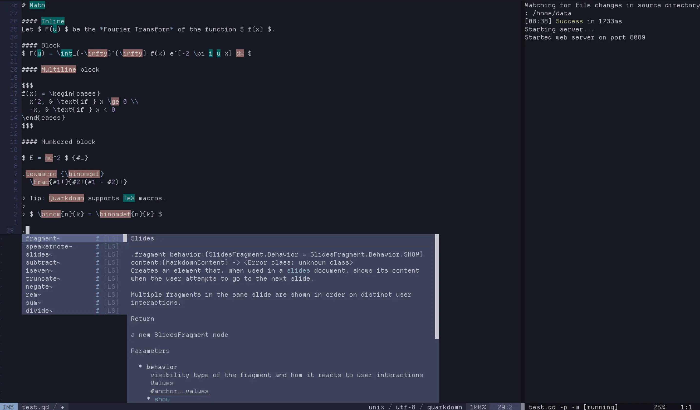

# coc-quarkdown



> Example from Quarkdown's collection of mock documents

[Quarkdown](https://github.com/iamgio/quarkdown) support for [coc.nvim](https://github.com/neoclide/coc.nvim).

## Features

* LSP Support: Powered by `quarkdown-lsp` (via Quarkdown's CLI)
* Completions: Smart completion for keywords and functions.
* Semantic Highlighting: Colouring for function calls, types, and parameters.
* Compilation: Built-in commands to compile and watch Quarkdown files.

## Installation

1. Ensure the `quarkdown` CLI is installed and in your `$PATH`.
2. Ensure you have [coc.nvim](https://github.com/neoclide/coc.nvim) installed.
Follow their setup instructions.
3. Either of the installation methods listed below.

> Note: The associated keybinds and LSP takes *a while* to load after the first installation.

### CocInstall

Using `:CocInstall` directly.

```vim
:CocInstall https://github.com/bladeacer/coc-quarkdown
```

___

### Package managers

Using your favourite vim/nvim package manager.

#### vim-plug

For [vim-plug](https://github.com/junegunn/vim-plug).

```vim
call plug#begin()
    Plug 'bladeacer/coc-quarkdown', {'do': 'npm install && npm run build'}
call plug#end()
```

Installation might sometimes requires a few tries to get through.
Try saving the configuration file, restarting Vim and calling `:PlugInstall`.

There should be `stdout` output when building the extension.

#### lazy.nvim

For [lazy.vim](https://github.com/folke/lazy.nvim).

```lua
{
  'bladeacer/coc-quarkdown',
  build = 'npm install && npm run build',
  ft = { "quarkdown", "qd" }
}
```

## Commands and Keymaps

This extension registers the following commands:

| Command | Description | Default Keymap (Local) |
|---------|-------------|-------------------------|
| `coc-quarkdown.compile` | Compiles the current file | `<leader>mc` |
| `coc-quarkdown.watch` | Starts compiler in watch mode | `<leader>mw` |
| `coc-quarkdown.stop` | Stops any active action (compile/watch) | `<leader>ms` |

> **Note**: Keymaps are buffer-local and only activate for `quarkdown` filetypes.

By default, the extension maps `<leader>qc` and `<leader>qw` for you.
If you want to use different keys, you can override the defaults in your
configuration file.

### Vim

Adapt into to your `.vimrc` or its equivalent.

```vim
" Example: Change the compilation shortcut to F5
autocmd FileType quarkdown nnoremap <buffer> <F5> :CocCommand coc-quarkdown.compile<CR>
```

### Nvim

Adapt into to your `init.lua` or its equivalent.

```lua
vim.api.nvim_create_autocmd("FileType", {
  pattern = "quarkdown",
  callback = function()
    -- Example: Compile on F5
    vim.keymap.set("n", "<F5>", ":CocCommand coc-quarkdown.compile<CR>", { buffer = true, silent = true })
  end,
})
```

### Planned Features

* Pass custom flags (configuration + runtime override) when running compile/watch.

## License

MIT.

---

## Credits

* [Quarkdown](https://github.com/iamgio/quarkdown) for the LSP implementation
and awesome software :D
* Built with [create-coc-extension](https://github.com/fannheyward/create-coc-extension).
